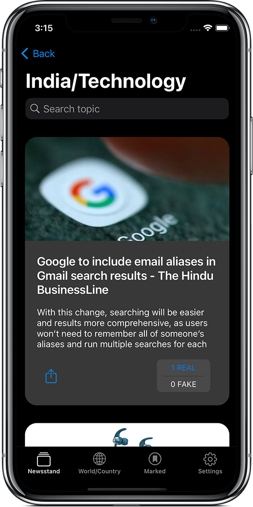
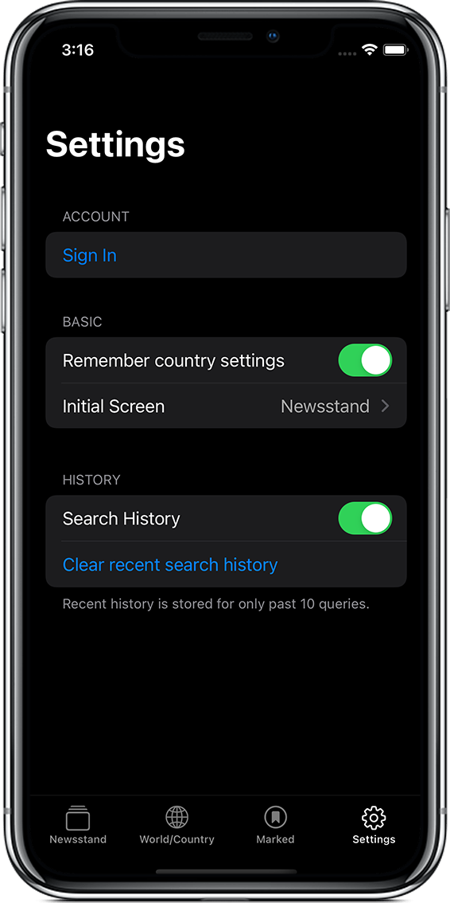

# newsApp <a href="https://img.shields.io/badge/status-completed-4BC51D.svg"></a> <!--<a href="https://img.shields.io/badge/updating-4BC51D.svg"></a>--> <a href="https://img.shields.io/badge/minimum%20platform-iOS%2014.1-blue.svg"></a> <a href="https://github.com/SwiftyJSON/SwiftyJSON"></a> <a href="https://github.com/firebase/firebase-ios-sdk"></a> <a href="https://github.com/firebase/firebase-ios-sdk"></a>
Read news. Mark news as real or fake. Or see what others have marked.

## Build Instructions 🛠
0. A small prerequisite 🥺

   In order for the build to succeed and for this app to actually fetch the news, along with the files in this repo, it also requires a file called "Secrets.plist"    which should be placed inside the "newsApp" folder in this repo. Though named Secrets with an s, it needs to hold only one secret which should be your API key to    the newsapi.org REST API which can be obtained for free from [newsapi.org/register](https://newsapi.org/register).
   <br><br>
   Once you have the API key, clone the repo and create a "Secrets.plist" file inside newsApp folder (alongside Constants.swift). Follow the steps below to see how to create plist file using xcode or you may create it using touch terminal command.
   <br><br>
   `
   Open newsApp.xcworkspace > Expand newsApp project > Right-click newsApp folder > New File... > Property List > Save As: Secrets.plist
   `
   <br><br>
   Then, either
   <br>
   From within XCode, select Secrets.plist and create a new item with String as its type with API_KEY as Key and the api key you obtained from newsapi.org as value.
   <br><br>
   Or
   <br>
   Open Secrets.plist with a text editor (textEdit, etc.) and paste the following in the file before replacing \[YOUR_API_KEY] with the key obtained from newsapi.org.
   ```
    <?xml version="1.0" encoding="UTF-8"?>
    <!DOCTYPE plist PUBLIC "-//Apple//DTD PLIST 1.0//EN" "http://www.apple.com/DTDs/PropertyList-1.0.dtd">
    <plist version="1.0">
    <dict>
     <key>API_KEY</key>
     <string>[YOUR_API_KEY]</string>
    </dict>
    </plist>
   ```
   Now that we have the secret ingredient, we shall proceed further with the recipe! 😋

1. The basic stuff 💁🏻‍♀️

   newsApp is built using Swift 5 and on XCode 12 and uses cocoapods. Now, you probably already have XCode or else why would you be even reading this but just in      case you don't, get it from [here](https://apps.apple.com/in/app/xcode/id497799835).
   
2. And we are almost done! ✅

   That was it, the setup. Now all you have to do is open newsApp.xcworkspace if you haven't already and hit run! Just make sure you set the active scheme as newsApp before running and you're good to go. If you're wondering what's active scheme, it is this in the xcode toolbar at the top:
   <br><br>
   

## Features 😮
 - Filter news by category, country or both
 - Search for any topic
 - See how many people have marked a news as real or fake
 - Ability to mark news as real or fake
 - See or post public views
 
 ## Back-end services 🔨
 - [NewsAPI](https://newsapi.org/) - REST API
 - [Google Firebase](https://firebase.google.com/) - User Authentication & Database

## Sneak Peek 👀
&emsp;&emsp;&emsp;&emsp;
<br><br>
&emsp;&emsp;&emsp;&emsp;
<br><br>

